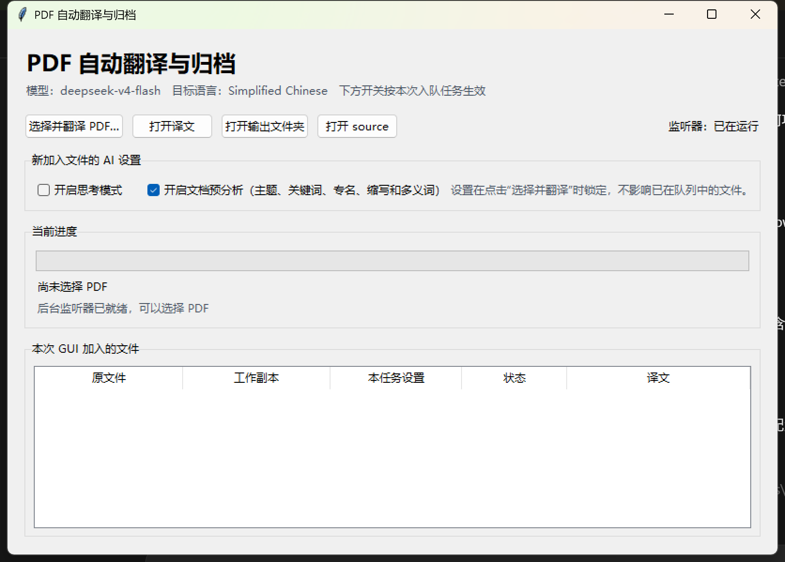
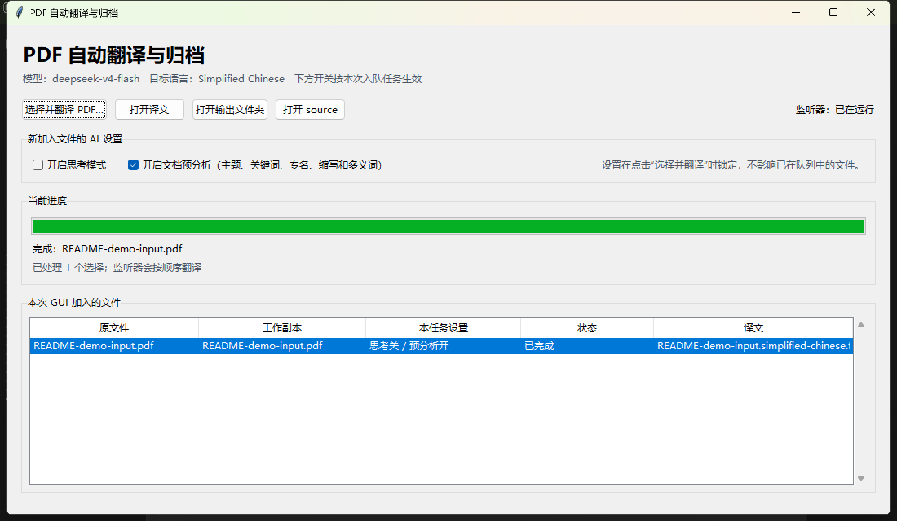
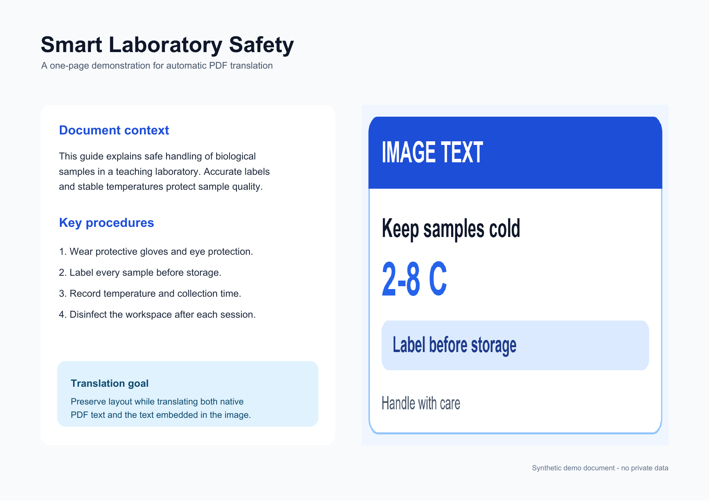
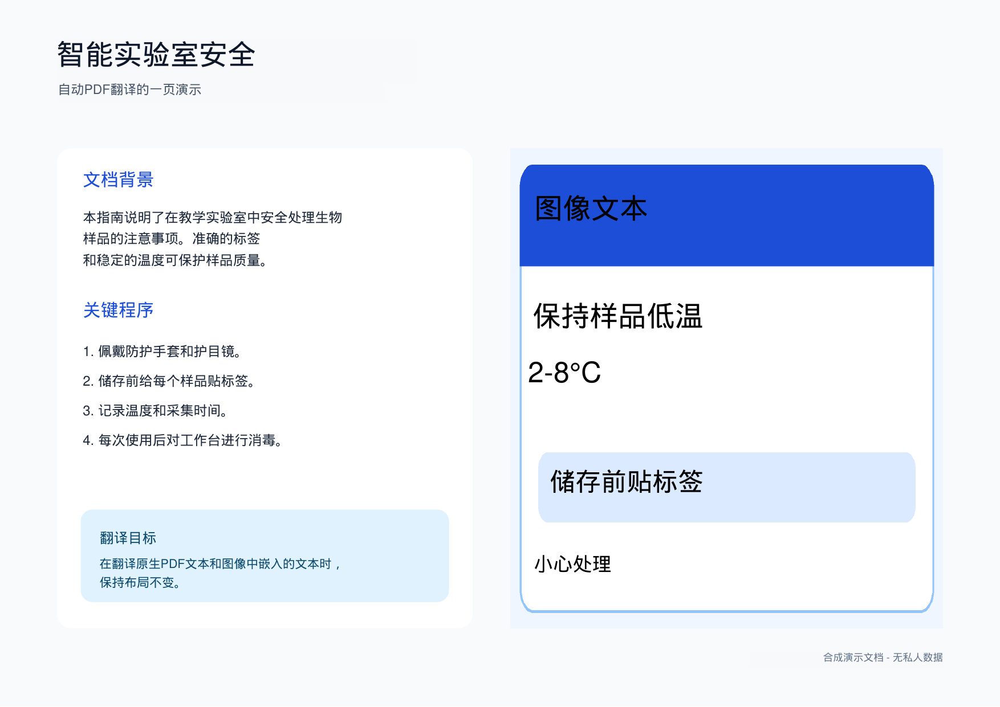

<p align="center">
  <a href="README.md">简体中文</a> · <a href="README.en.md">English</a> · <strong>日本語</strong> · <a href="README.mars.md">吙煋呅</a>
</p>

<h1 align="center">PDF 自動翻訳・アーカイブ</h1>

<p align="center">
  画像 OCR、元レイアウトへの再配置、文書コンテキスト解析に対応した、無料・非商用プロジェクトの PDF 翻訳ソフトウェアです。
</p>

<p align="center">
  <a href="https://github.com/Larryppg/auto_pdf_translator/actions/workflows/tests.yml"></a>
  
  
  
</p>

> [!IMPORTANT]
> **ソフトウェア本体は完全無料で、非商用プロジェクトとして開発・保守されています。**
> ライセンス料、購読料、機能課金はありません。インストール後、ローカルの `.env` に
> 自分の DeepSeek API キーを設定するだけで利用できます。DeepSeek は外部 API のため、
> アカウント、利用枠、API 利用料金は無料ソフトウェア本体には含まれません。

> [!NOTE]
> **現行バージョンは、当面 DeepSeek の OpenAI 互換 API を標準バックエンドとして使用し、
> 実動作を確認しています。** 他の OpenAI 互換エンドポイントも設定できますが、現時点では
> 正式サポート対象として個別検証していません。

## スクリーンショット

<p align="center">
  <a href="docs/images/gui-main.png"></a>
  <a href="docs/images/gui-completed.png"></a>
</p>
<p align="center"><sub>実際の Windows GUI。ファイル選択、思考モードと事前解析の切り替え、進行状況、完了結果を確認できます。画像をクリックすると原寸で表示します。</sub></p>

### 画像内文字の翻訳とレイアウト保持

<p align="center">
  <a href="docs/images/demo-source.png"></a>
  <a href="docs/images/demo-translated.png"></a>
</p>
<p align="center"><sub>左：英語原文、右：簡体字中国語の翻訳結果。アプリで実際に処理した、個人情報を含まない合成ページで、PDF ネイティブ文字と画像内文字の両方を含みます。</sub></p>

## 主な利点

- **画像内の文字も翻訳**：図、スクリーンショット、スキャン領域をローカル OCR で認識してから翻訳します。
- **元の文字位置と書式を可能な限り維持**：元のテキストボックス、配置、色、背景サンプリング、自動フォント縮小を利用して同じ位置へ書き戻します。
- **翻訳前に文書コンテキストを検出**：テーマ、分野、キーワード、固有名詞、略語、文脈依存の多義語を分析し、後続バッチへ推奨訳を渡します。
- **思考モードを切り替え可能**：GUI から投入するジョブごとに DeepSeek 思考モードをオン・オフできます。
- **事前解析を切り替え可能**：専門文書ではオン、短く単純な文書ではオフにして時間を節約できます。
- **自動監視とアーカイブ**：`source/` に追加された PDF を自動検出し、出力検証後に作業コピーを整理します。
- **追跡・復旧を重視**：進捗率、ETA、再試行、完全性検査、manifest、エラー記録、ハッシュ重複排除を備えます。

## 処理の流れ

```text
GUI で PDF を選択、または source/ に追加
                 │
                 ▼
コピー完了までファイルの安定状態を確認
                 │
                 ▼
PDF ネイティブ文字抽出 + 画像領域のローカル OCR
                 │
                 ▼
任意：テーマ、キーワード、専門用語、多義語の事前解析
                 │
                 ▼
安定 ID を使った分割翻訳、用語集、欠落チェック
                 │
                 ▼
元の文字領域へ翻訳文を自動レイアウト
                 │
                 ▼
一時 PDF を再度開き、ページ数と可読性を検証
                 │
                 ▼
translated/ に保存し、作業コピーをアーカイブ
```

デスクトップやダウンロードフォルダーから GUI で選択した元 PDF は移動・削除されません。
GUI が `source/` に安全な作業コピーを作成し、アーカイブ対象になるのはそのコピーだけです。

## 必要環境

- Windows
- Python 3.11 以降
- 自分の DeepSeek API キー

OCR はローカルで実行されます。API へ送信するのは抽出された文字列と安定 ID であり、
レンダリングした PDF ページ画像ではありません。

## クイックスタート

```powershell
git clone https://github.com/Larryppg/auto_pdf_translator.git
cd auto_pdf_translator
Set-ExecutionPolicy -Scope Process Bypass
.\scripts\setup.ps1
```

セットアップ後、作成された `.env` に自分の DeepSeek API キーを入力します。

```dotenv
OPENAI_API_KEY=replace-with-your-own-deepseek-api-key
```

DeepSeek が OpenAI 互換 API を提供しているため、環境変数名は `OPENAI_API_KEY` のままです。

```dotenv
OPENAI_BASE_URL=https://api.deepseek.com
OPENAI_MODEL=deepseek-v4-flash
```

実際の API キーや `.env` を GitHub にコミットしないでください。

## GUI の使い方

`启动PDF翻译GUI.cmd` をダブルクリックし、**选择并翻译 PDF…** を選択します。複数の PDF を
一度に投入でき、文字抽出/OCR、事前解析、AI 翻訳、レイアウト、検証、保存、アーカイブの
進捗率と ETA を確認できます。

ファイルを選ぶ前に、2 つの設定を個別に切り替えられます。

- **开启思考模式 / 思考モードを有効化**：複雑な文脈に役立つ場合がありますが、通常は遅くなります。
- **开启文档预分析 / 文書事前解析を有効化**：テーマ、分野、キーワード、固有名詞、略語、多義語を翻訳前に検出します。

設定はファイル投入時に固定され、すでに待機中または処理中のジョブには影響しません。
標準値は **思考モード OFF、事前解析 ON** です。

GUI を閉じてもバックグラウンド監視は停止しません。`一键启动PDF翻译器.cmd`、PowerShell
スクリプト、CLI は独立したバックアップ手段としてそのまま利用できます。

## CLI と監視フォルダー

```powershell
# 環境チェック
.\.venv\Scripts\python.exe -m pdf_translation_workflow --config .\config.toml doctor

# 継続監視
.\scripts\start_watcher.ps1

# 一回だけ処理
.\.venv\Scripts\python.exe -m pdf_translation_workflow --config .\config.toml once

# 最近のジョブ
.\.venv\Scripts\python.exe -m pdf_translation_workflow --config .\config.toml status
```

手動で `source/` に追加したファイルは `config.toml` の標準設定を使用します。GUI から投入した
ファイルでは、思考モードと事前解析だけをジョブ単位で上書きできます。

## 主な設定

```toml
[translation]
thinking_mode = "disabled" # disabled, enabled, provider_default

[document_analysis]
enabled = true
required = false
sample_characters = 18000
max_keywords = 24
max_terms = 48

[translation.glossary]
organoid = "類器官"
extracellular_matrix = "細胞外マトリックス"
```

## プライバシーとセキュリティ

`.env`、`.venv`、`.state`、`source`、`translated`、`archive`、`failed` は Git の対象外です。
これらには非公開 PDF、OCR 文字列、翻訳、manifest、ローカルパス、エラー、ログが含まれる
可能性があります。キーを誤って公開した場合は、Git の後続コミットから削除するだけではなく、
API 提供元で直ちに無効化し、新しいキーを作成してください。

## 現在の制限

- パスワード保護 PDF の解除は行いません。
- OCR 品質は画像の解像度と鮮明さに依存します。
- 手書き、曲線・回転文字、複雑な数式、細かい背景は難しい場合があります。
- 画像内文字は背景色をサンプリングした矩形で覆ってから検索可能な翻訳文を挿入するため、複雑な背景では色の差が見えることがあります。
- 長い翻訳文ではフォントが縮小され、警告が記録される場合があります。
- デジタル署名付き PDF を変更すると元の署名は無効になります。

## テストとライセンス

```powershell
.\.venv\Scripts\python.exe -m pytest
```

MIT License で配布しています。プロジェクト自体は無料・非商用の方針で保守されていますが、
外部 API の利用条件と料金は API アカウント所有者の責任となります。
